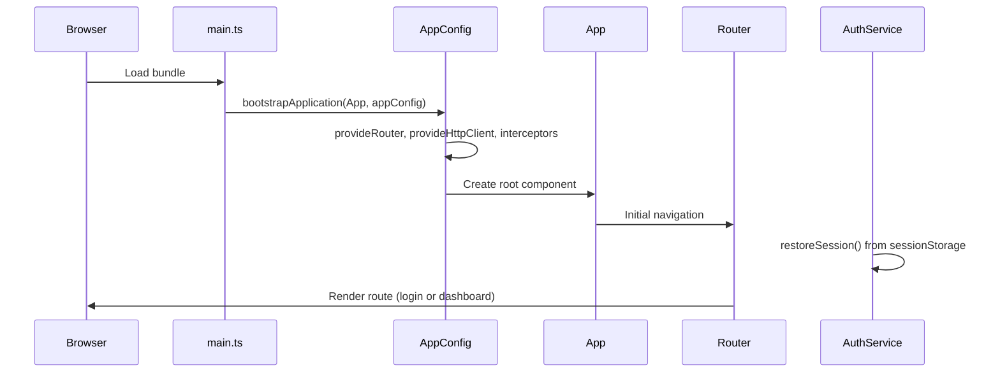
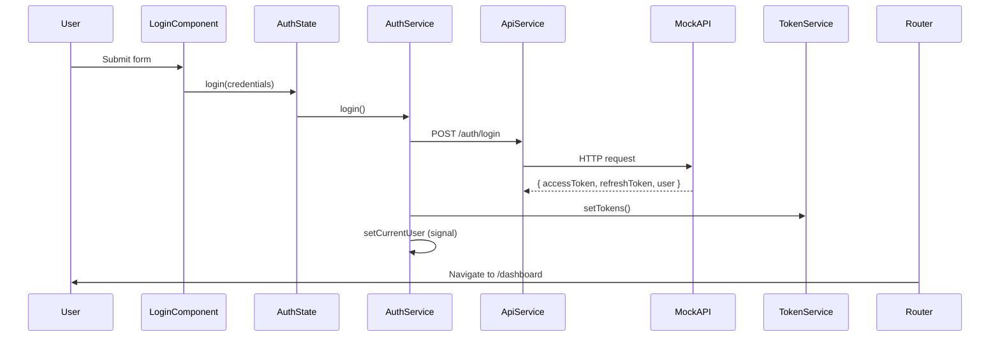
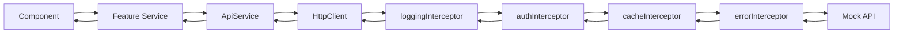

# Flow Explanation

Complete lifecycle diagrams for the Healthcare Management System.

## 1. Application startup



**Files to read in order:**
1. `src/main.ts`
2. `src/app/app.config.ts`
3. `src/app/app.ts`
4. `src/app/app.routes.ts`
5. `src/app/core/services/auth.service.ts` → `restoreSession()`

---

## 2. Login flow



---

## 3. Routing lifecycle

When you navigate to `/users/123`:

| Step | What happens |
|------|----------------|
| 1 | Router matches `users/:id` |
| 2 | `authGuard` runs — checks token + user signal |
| 3 | `roleGuard` runs — checks `data.roles` includes Admin |
| 4 | `userDetailResolver` fetches user **before** component renders |
| 5 | `UserDetailComponent` receives `user` via `input()` binding |
| 6 | Component renders with data already available |

**Why resolvers?** Avoid "flash of empty template" while HTTP loads.

---

## 4. HTTP request lifecycle



**Interceptor order matters** — registered in `app.config.ts`:
1. **logging** — debug trace
2. **auth** — attach Bearer token
3. **cache** — return cached GET for reports
4. **error** — handle 401 refresh, toasts for 403/500

---

## 5. Change detection flow

Angular 21 default uses **zoneless** change detection when `provideZonelessChangeDetection()` is enabled.

| Trigger | Example |
|---------|---------|
| Signal update | `currentUserSignal.set(user)` |
| Observable via async pipe | `users$ \| async` |
| DOM event | `(click)="save()"` |
| OnPush + @Input change | DataTable receives new `[data]` |

**OnPush components** only check when:
- Inputs change
- Events fire inside component
- Signals read in template change
- `markForCheck()` called

---

## 6. Lazy loading flow

```typescript
// app.routes.ts
{
  path: 'patients',
  loadChildren: () => import('./features/patients/patients.routes')
    .then(m => m.PATIENTS_ROUTES),
}
```

1. User first visits `/patients`
2. Router downloads `patients.routes` chunk (separate JS file)
3. Route config activates
4. Child component chunk loads (`patient-list.component`)
5. Component renders inside `MainLayoutComponent` router-outlet

**Network tab:** You will see new `.js` chunks appear on first navigation.

---

## 7. Logout flow

1. User clicks Logout in header menu
2. `AuthService.logout()` clears sessionStorage + signals
3. Router navigates to `/auth/login`
4. `guestGuard` prevents logged-in users from seeing login again

---

## Hands-on exercises

1. **Trace login:** Set breakpoint in `auth.interceptor.ts` → login → watch header added on next request.
2. **Break refresh:** Expire token in DevTools → trigger API call → watch `errorInterceptor` refresh attempt.
3. **Role test:** Login as nurse → manually go to `/users` → watch `roleGuard` redirect.
4. **Resolver:** Navigate to `/users/1` → Network tab shows GET before component paint.
5. **Lazy load:** Clear cache → open Network → navigate features → observe chunk loading.
