# MS&AMD Module Flow Diagrams

Sequence and flow diagrams derived from **MS&AMD_Module_Flow_Presentation.pptx** — Saudi Aramco MS&AMD (Medical Services & Affiliation Management Department) and BUPA Arabia Automated Communication System.

---

## 1. System Overview & User Roles

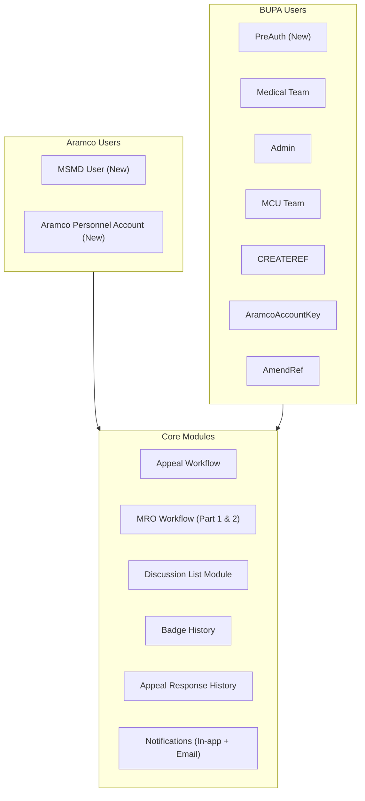

---

## 2. High-Level Appeal Workflow

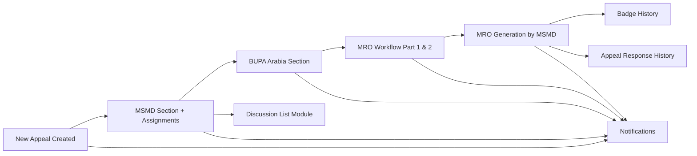

---

## 3. Flow 1 — Appeal Lifecycle (End-to-End)

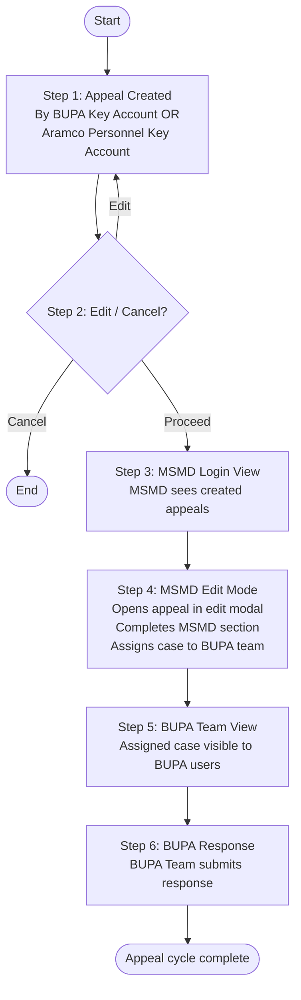

---

## 4. Flow 1 — Appeal Sequence Diagram

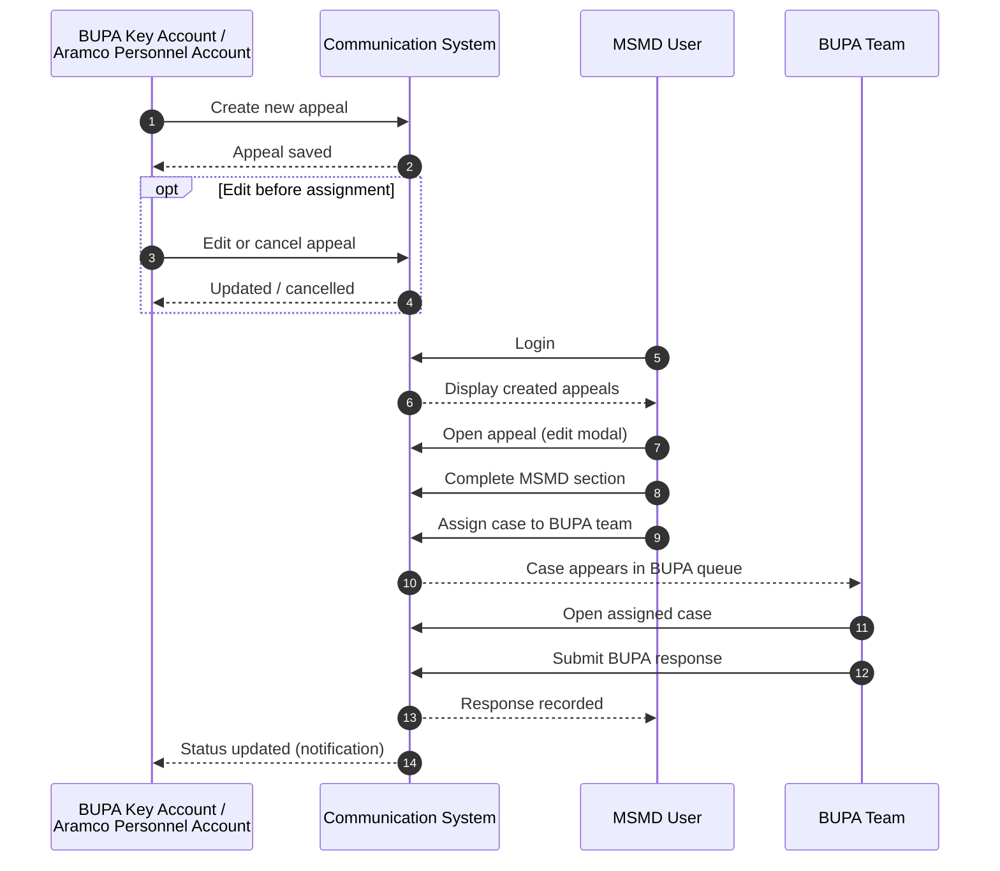

---

## 5. Flow 2 — MRO Process (Overview)

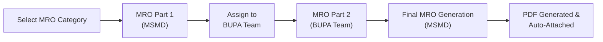

---

## 6. Flow 2 — MRO Detailed Steps

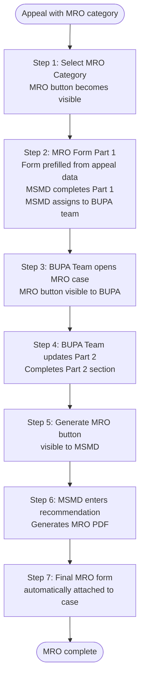

---

## 7. Flow 2 — MRO Sequence Diagram

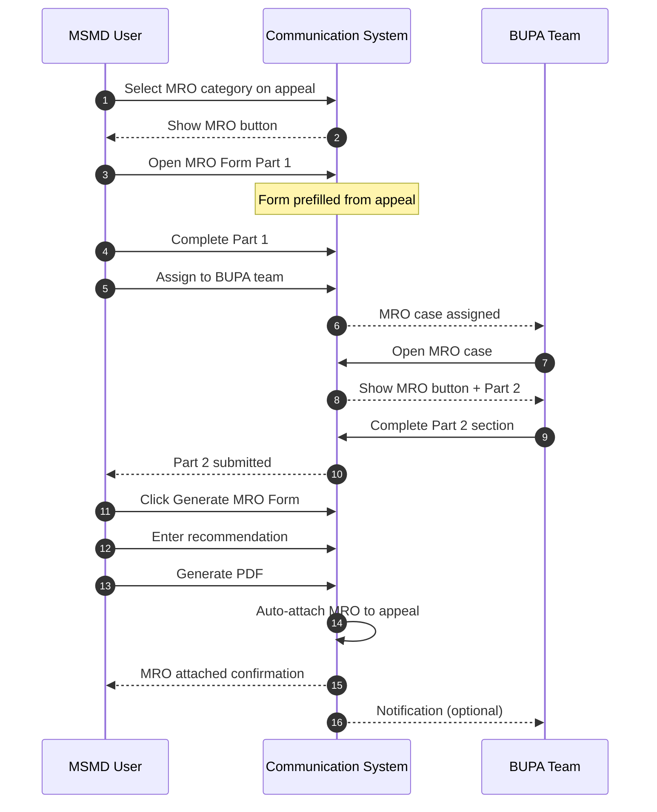

---

## 8. Discussion List Module

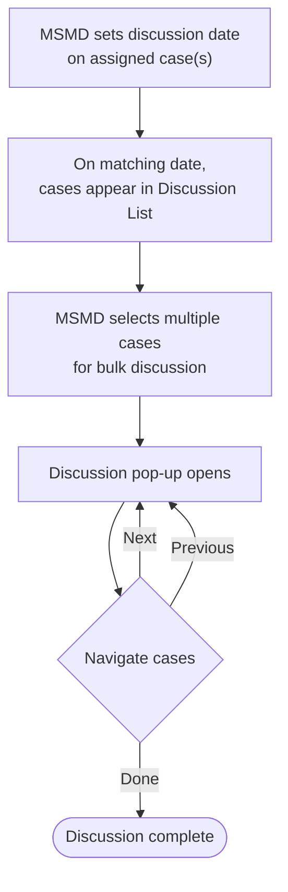

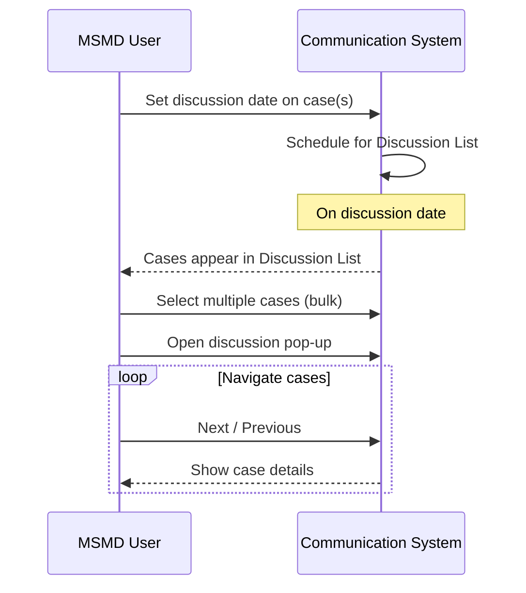

---

## 9. History & Audit Modules

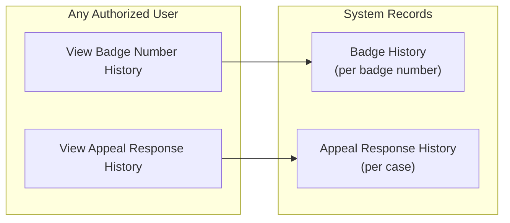

---

## 10. Notification Flow

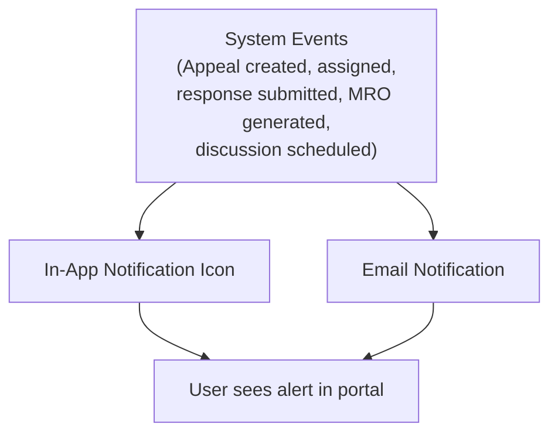

```mermaid
sequenceDiagram
    participant Actor as User (MSMD / BUPA / Creator)
    participant System as Communication System
    participant Notify as Notification Service
    participant Recipient as Target User

    Actor->>System: Trigger workflow action<br/>(assign, respond, generate MRO, etc.)
    System->>Notify: Publish event
    Notify->>Recipient: In-app notification (icon/badge)
    Notify->>Recipient: Email notification
    Recipient->>System: View notification / open case
```

---

## 11. Landing Page by Role

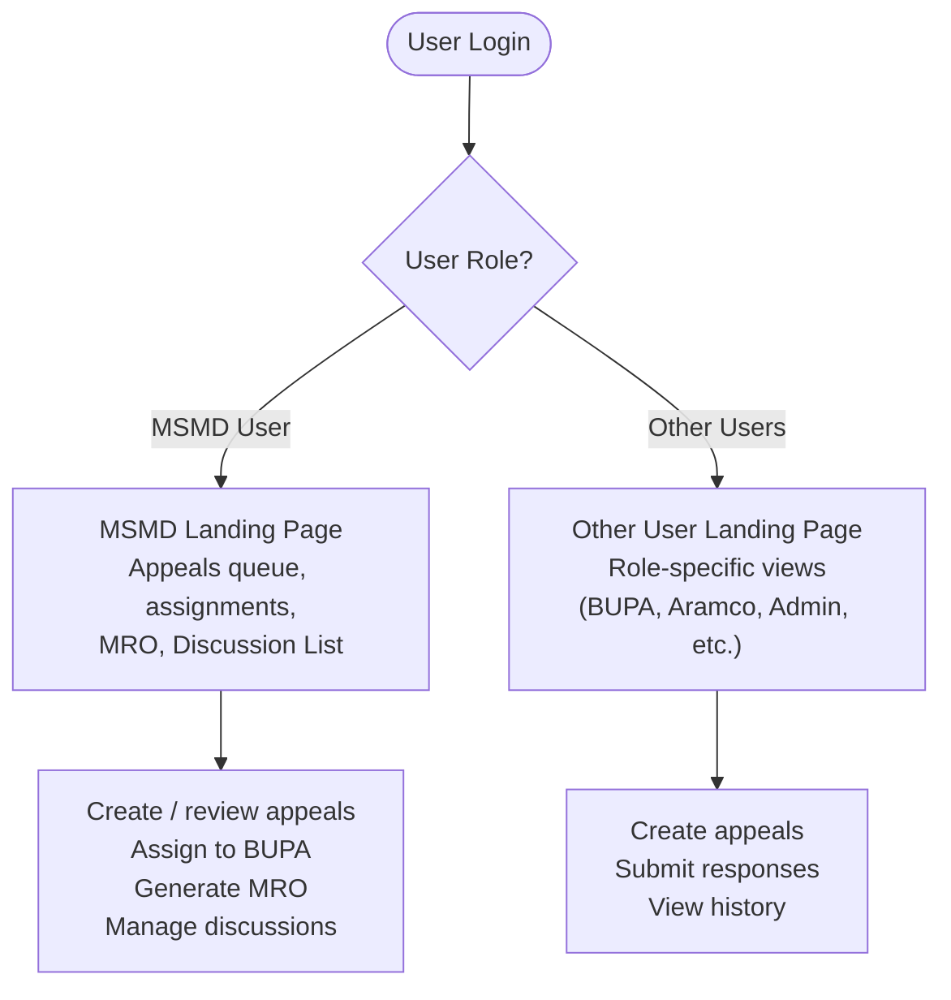

---

## 12. Complete System Interaction (Master Sequence)

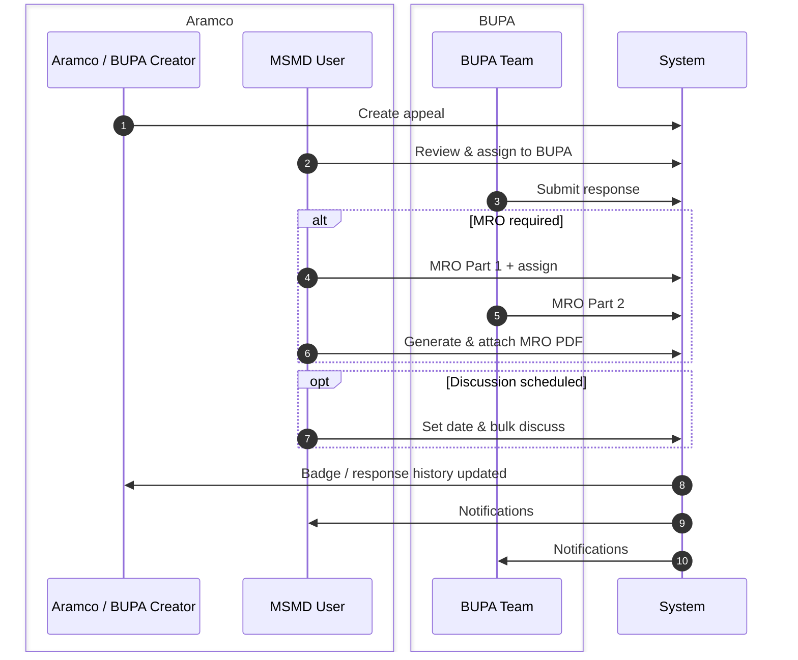

---

## Summary Mapping (Slides → Diagrams)

| Presentation section | Diagram(s) |
|----------------------|------------|
| Slides 2–3 (Roles & overview) | #1, #2, #11 |
| Slides 6–11 (Flow 1 — Appeal) | #3, #4 |
| Slides 12–19 (Flow 2 — MRO) | #5, #6, #7 |
| Slides 20–21 (Discussion) | #8 |
| Slides 22–24 (History) | #9 |
| Slides 25–26 (Notifications) | #10 |
| All flows combined | #12 |

**Source:** `docs/MS&AMD_Module_Flow_Presentation.pptx`
